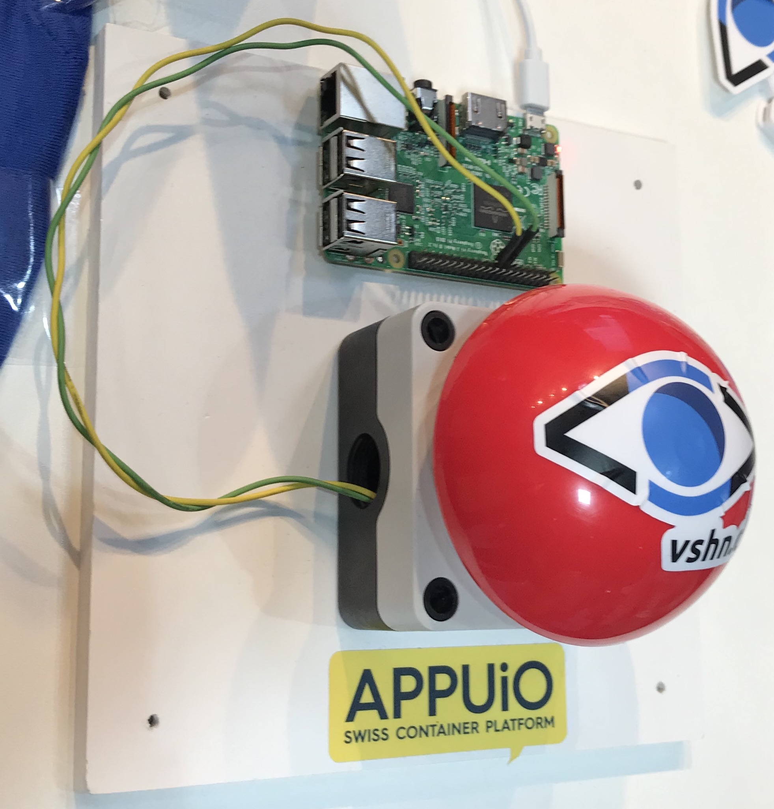

# Chaosbutton


A large red button connected to a Raspberry Pi bringing chaos and mayhem to your
 kubernetes-based service by killing a pod by random

## How to create an OpenShift service account with a token that does not expire
```
oc create sa chaosbutton
oc policy add-role-to-user edit -z chaosbutton
oc describe sa chaosbutton | grep "Tokens:"
# get the secret name of the "Token"
oc describe secret chaosbutton-token-asd42 | grep "token:"
# copy the token and use below
```
## How to install on Raspberry Pi
```
curl -s https://packages.cloud.google.com/apt/doc/apt-key.gpg | sudo apt-key add -
echo deb http://apt.kubernetes.io/ kubernetes-stretch main > /etc/apt/sources.list.d/kubernetes.list
apt-get update
apt-get install git python3-pip kubectl
pip3 install RPi.GPIO kubernetes
git clone https://github.com/arska/chaosbutton.git
cd chaosbutton
kubectl config set-cluster appuio --server='https://api.cloudscale-lpg-2.appuio.cloud:6443'
kubectl config set-credentials appuio --token='kjhbmjhvbnbvnbv' # get a valid token e.g. above
kubectl config set-context appuio --cluster=appuio --user=appuio
kubectl config use-context appuio
python3 app.py
```
# To install the systemd service to start at boot
```
cp chaosbutton.service /lib/systemd/system/
sudo systemctl daemon-reload
sudo systemctl enable chaosbutton.service
```

# How to I configure which pod gets killed?
See "namespace" and "selector" constants in app.py.

namespace: the Kubernetes namespace (orr OpenShift project) name you want to operate in

selector: is the `label=value` from which one pod is selected by random, used as a
 filter to query the Kubernetes API

# How do I build the Button and the Raspberry pi?
I ordered my button locally in Switzerland from https://www.bastelgarage.ch/buzzer-taster-rot because it was the cheapest delivered to me.

By default this application uses pin 15 (see "channel" in app.py) on the raspberry pi
 IO header because pin 17 next to it has +3.3v power. connecting these to pins
  together using the button is used as a trigger to kill one pod.
